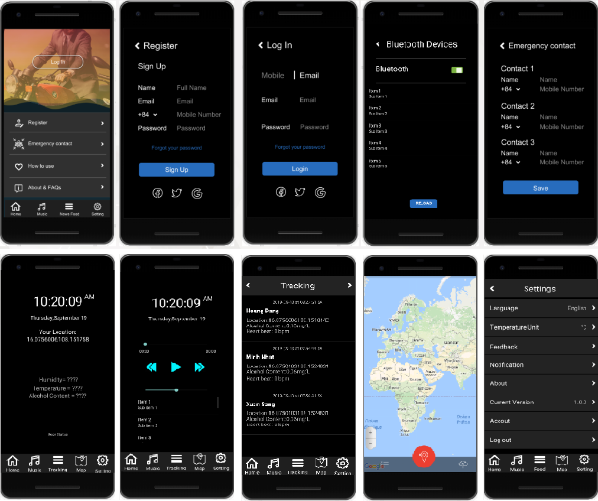

# Smart Helmet Full (Kotlin)

Redefine Your Safety! 

Smart Helmet provides you with a trip with a different experience.

The app supports Bluetooth to connect the Smart Helmet device, proving you with comprehensive and accurate data.

Basic funtions:

- Equipped with Bluetooth headset & conversation mic to listen for calls and warning sounds.

- Warn and give recommendations to ensure safety for users when the alcohol content exceeds the permitted level.

- Warn drivers when signs of drowsiness.

- Identify and send a text message (email) to a relative about the location when a collision is identified

 # App's interface on mobile phones

